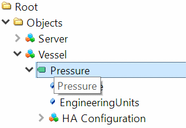

# Creating a server exposing a simple historizing variable

In this tutorial, we are going to create a simple server that
exposes the pressure of a vessel as an historizing variable.

[sample_server_with_historizing_variable.js](#the-server-script "save:") script.

### the server script

Let's use a very basic server script :

``` javascript
const opcua = require("node-opcua");
const path = require("path");

function construct_address_space(server) {
  const addressSpace = server.engine.addressSpace;
  const namespace = addressSpace.getOwnNamespace();
  _"create the vessel object"
  _"create historizing variable"
  _"adding historical configuration"
  _"simulating data"
};

(async () => {

    try {
        _"creating and starting the server"
    } catch(err) {
        console.log("Error = ", error);
    }
})();
```

### creating and starting the server

```javascript
        // Let's create an instance of OPCUAServer
        const server = new opcua.OPCUAServer({
            port: 26543, // the port of the listening socket of the server
            resourcePath: "/UA/MyLittleServer", // this path will be added to the endpoint resource name
            nodeset_filename: [
                opcua.standard_nodeset_file,
            ]
        });

        await server.initialize();

        construct_address_space(server);

        await server.start();
        console.log("Server is now listening ... ( press CTRL+C to stop)");
        console.log("port ", server.endpoints[0].port);
        const endpointUrl = server.endpoints[0].endpointDescriptions()[0].endpointUrl;
        console.log(" the primary server endpoint url is ", endpointUrl );
```

We add the code to create the variable inside the ```construct_address_space``` method.

### create the vessel object

The vessel object will appear in the standard Object Folder

``` javascript
const vessel = namespace.addObject({
    browseName: "Vessel",
    organizedBy: addressSpace.rootFolder.objects
});

```

### create historizing variable

We will create  the ``vesselPressure``` variable as a AnalogDataItem, so we can specify
engineering  units in Bars and value range.

``` javascript
const vesselPressure = namespace.addAnalogDataItem({
    browseName: "Pressure",
    engineeringUnitsRange: {
        low:  0,
        high: 10.0
    },
    engineeringUnits: opcua.standardUnits.bar,
    componentOf: vessel
});
```

### adding historical configuration

We now declare the vesselPressure variable to be a Historical data node.

``` javascript
addressSpace.installHistoricalDataNode(vesselPressure);
```

InstallHistoricalDataNode does a few things for us:
  * it instantiate a HA Configuration object
  * it sets the historizing flag of the variable
  * it starts recording value changes into a small online data storage of 2000 values.

### simulating data

To see the value change and create a fake history, we can simply install a timer
to change the value on a regular basis.

```javascript
// simulate pressure change
let t = 0;
setInterval(function() {
  let value = (Math.sin(t/50)*0.70+Math.random()*0.20)*5.0+5.0;
  vesselPressure.setValueFromSource({dataType:"Double",value:value});
  t=t+1;
}, 200);

```

### exploring the results with UAExpert:

It is now time to launch your favorite OPCUA Client to check the results.

The Vessel exposing the historizing VesselPressure variable and its HA Configuration object:



The History graph:


source code : [source.js](./sample_server_with_historizing_variable.js)
